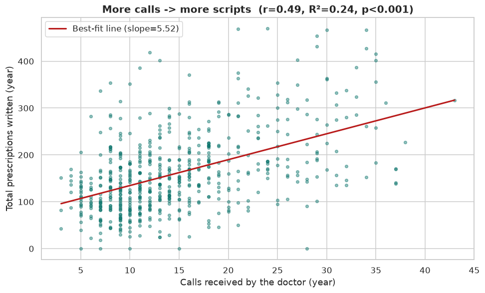
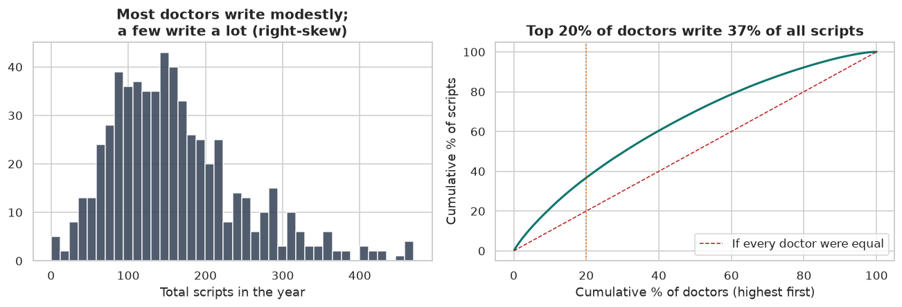
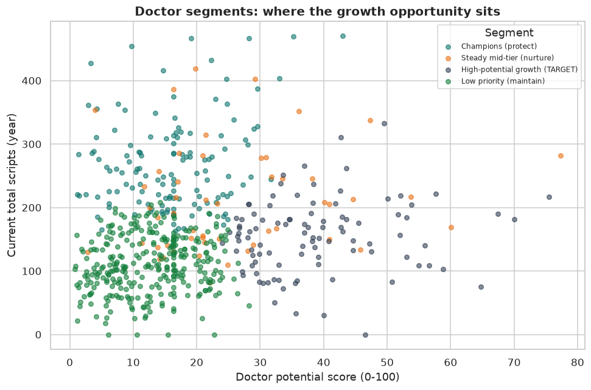

# Project 1 — Pharmaceutical CRM Sales Analytics
SYNTHETIC pharma sales data · Python, statistics, machine learning, SQL

## Executive summary (for a non-technical reader)
This project looks at the questions a pharma sales leader usually has: who is performing, what drives
prescriptions, and which doctors to focus on next.

More rep visits are associated with more prescriptions. The correlation is positive (r = 0.49) and the
regression is highly significant (p ≈ 1.5e-37). On this data, each extra call per year is associated
with about 5.5 more scripts. Prescribing is also concentrated: the top 20% of doctors write roughly a
third of all scripts, so which doctors a rep visits matters as much as how many visits they make.

Performance varies a lot between reps. The top rep drove 6,007 scripts against 154 for the lowest,
which points to a coaching and territory-balancing opportunity. Southeast leads on volume and Cardiplex
is the top product.

A KMeans segmentation split the 600 doctors into four groups and isolated a 99-doctor "High-potential
growth" segment: doctors with headroom who respond to calls but aren't prescribing at capacity. That is
where added call effort should pay off. The practical takeaway is to shift calls toward that segment,
keep enough contact with the champions to retain them, and coach the weaker reps using the patterns the
top reps already follow.

> Data label: SYNTHETIC. Real CRM data (rep calls, doctor prescribing) is proprietary and
> privacy-sensitive, so every row is fabricated by a seeded generator (`data/generate_data.py`).
> The relationships are realistic by design; the people and numbers are not real. See `NOTES.md`.

---

## Problem
A pharmaceutical commercial team needs an evidence-based read on rep, region, and product performance,
on what actually drives prescriptions, and on where to focus limited call capacity. Three business
questions:
1. Which reps, regions, and products are performing best and worst?
2. Does call frequency correlate with prescription volume (tested with correlation and regression)?
3. Which doctor (HCP) segments should the team prioritise?

## Approach
1. Generated synthetic data with a reproducible, seeded script (`data/generate_data.py`) that injects
   realistic messiness: duplicates, missing values, mixed text and date formats, impossible values.
2. Cleaned the data and recorded every decision in a markdown table. I deduped, standardised
   region/product text, parsed mixed date formats, set impossible values to missing, and imputed where
   it made sense.
3. Ran EDA on scripts by product and region, the concentration of prescribing across doctors, and call
   activity.
4. Went deeper with a rep/region/product leaderboard, an OLS regression of calls against scripts, and a
   KMeans segmentation of doctors.
5. Used SQL (SQLite) with a `RANK() OVER (PARTITION BY region ...)` window function to rank reps within
   their region.
6. Exported BI-ready star-schema tables and wrote up a prioritised recommendation.

## Key findings (with charts)

More calls are associated with more prescriptions. Each dot is a doctor; the upward line means visiting
a doctor more often goes with more scripts (r = 0.49, R² = 0.24, p ≈ 1.5e-37).


A small group of doctors drives a large share of scripts, which is why targeting matters.


The segmentation points to a clear growth target. The "High-potential growth" group has headroom and
responds to calls, so it's the best place to invest added effort.


| Metric (SYNTHETIC) | Value |
|---|---|
| Calls ↔ scripts correlation | r = 0.49 (R² = 0.24, p ≈ 1.5e-37) |
| Lift per additional call | ~5.5 scripts / year |
| Top product / region | Cardiplex / Southeast |
| Top vs bottom rep (scripts driven) | 6,007 vs 154 |
| Doctor segments found (KMeans, k=4) | Champions (133), Steady mid-tier (51), High-potential growth (99), Low priority (317) |
| Prescribing concentration | top 20% of doctors ≈ 37% of all scripts |

## Recommendation
- Reallocate calls toward the High-potential growth segment. These doctors have room to grow and
  respond to visits, so each call should return more scripts than visiting an already-loyal doctor.
- Keep enough contact with the Champions to retain them, without over-investing where there's no upside.
- Coach the weaker reps using the top reps' patterns (call frequency and scripts-per-call) and rebalance
  territory load toward the higher-potential regions.

## Limitations and next steps
This is correlation, not proof of causation, and it runs on synthetic data. To firm it up I'd add a
call-to-script time lag to check whether this month's calls lift next month's scripts, and move toward
causal evidence through a matched-control or A/B call experiment. I'd also bring in cost per call so the
recommendation optimises ROI rather than raw script volume.

---

## Repository contents
| Path | What it is |
|---|---|
| `analysis.ipynb` | The full, runnable analysis (executed top-to-bottom, outputs included) |
| `build_notebook.py` | Reproducibly builds `analysis.ipynb` from code (run, then execute with nbconvert) |
| `data/generate_data.py` | Seeded synthetic data generator (writes the raw CSVs) |
| `data/*.csv` | The generated raw datasets (reps, hcps, calls, prescriptions, products, regions) |
| `charts/` | All 7 generated figures |
| `dashboard/` | BI-ready star schema (`fact_scripts`, `fact_region_product_monthly`, `dim_rep/hcp/product/region`) |
| `DASHBOARD_GUIDE.md` | Step-by-step Tableau and Power BI build guide |
| `LEARN.md` | Walkthrough, glossary, and how to run it |
| `NOTES.md` | Issues encountered and how I resolved them |

## How to run it
```bash
cd project-1-pharma-crm
python3 data/generate_data.py        # regenerate the synthetic raw CSVs (seeded)
python3 build_notebook.py            # rebuild analysis.ipynb from code
python3 -m jupyter nbconvert --to notebook --execute --inplace analysis.ipynb
```
See `LEARN.md` for a step-by-step run-through.
