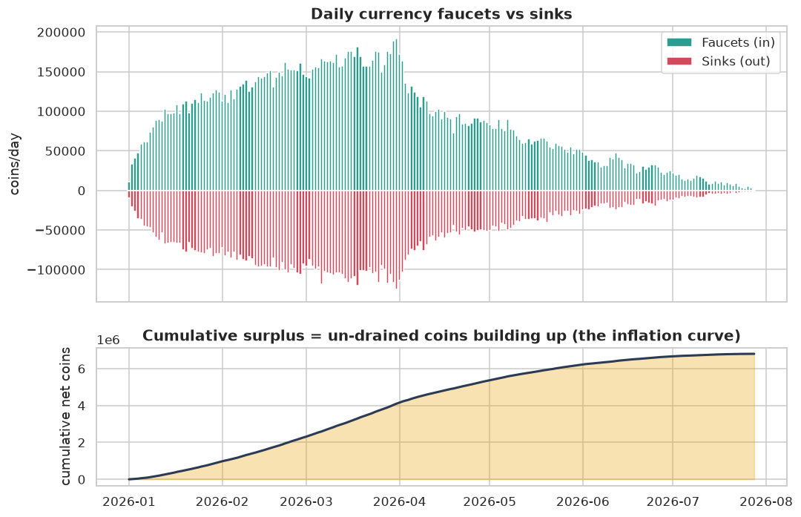
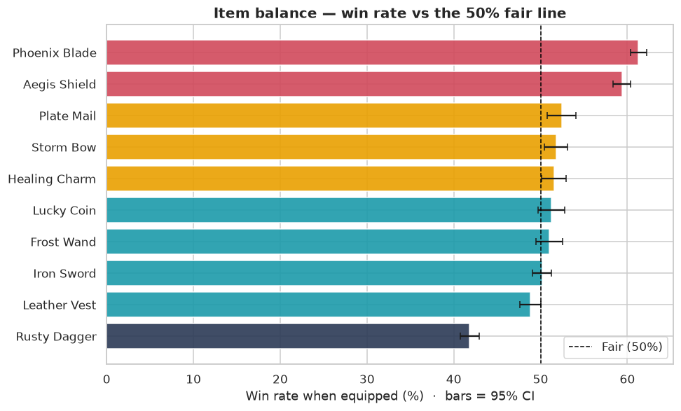
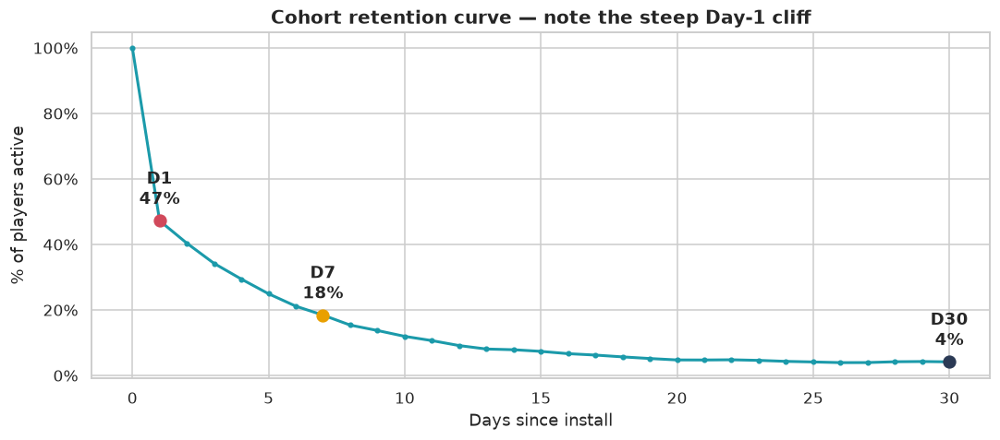

# Project 2 — Free-to-Play Game Economy & Balance Analytics
Portfolio project · SYNTHETIC telemetry · Python + statistics + SQL

## Executive summary (for a non-technical reader)
I built an end-to-end analytics pipeline for a free-to-play game on realistic synthetic telemetry (players, sessions, matches, a soft-currency ledger and purchases). The goal was to answer the three questions a producer cares about: is the economy healthy, are the items fair, and what makes players stay and pay?

The economy is mildly inflationary. Currency faucets (rewards) out-mint sinks (spending): sinks recover only ~63% of every coin created, so wallets steadily swell and the soft currency slowly loses value.

Two premium items are overpowered. Phoenix Blade wins 61.3% of its matches and Aegis Shield 59.4%, both well above the fair 50% line (confidence intervals entirely above 50%, p ≈ 0). Because both are paid items, the game currently reads as mildly pay-to-win. Rusty Dagger is the opposite problem, an underpowered starter item at 41.8%.

Retention drops hard after the first day: D1 47%, D7 18%, D30 4%. About half of installs never return on day 1, but the players who survive that first day are sticky. The biggest lever is the first session, not the late game.

Monetization is small but predictable. Only 5.8% of players ever pay (ARPPU $15.61), and payers are sharply distinguished by early engagement. A logistic model predicts payers from first-3-day behaviour with AUC 0.80 and about 74% accuracy.

The resulting plan: add a coin sink, nerf the two pay-to-win items, fix onboarding to attack the D1 drop, and target a fair early offer at high-propensity players.

> Data label: SYNTHETIC. All telemetry is generated by one seeded script (`data/generate_data.py`). A public Steam/Kaggle game dataset was not reachable from this sandbox, so a reproducible synthetic generator was the practical path (see `NOTES.md`).

---

## Problem
A game producer needs an evidence-based read on the live game's health across three areas:
1. Economy balance — do currency sources (faucets) match sinks (drains), or is there inflation/deflation?
2. Item balance — are any items over- or under-powered (unfair win rates), and is the game pay-to-win?
3. Retention & monetization — what drives players to stay (D1/D7/D30) and to pay, and can payers be predicted early?

## Approach
1. Generated reproducible synthetic telemetry (`data/generate_data.py`) with deliberate real-world messiness: missing values, duplicate rows, mixed-case names, mixed timestamp formats, stray whitespace, impossible negatives.
2. Cleaned and documented every decision in a table: de-duplication, platform/item-name standardisation, parsing two timestamp formats with one parser, turning impossible negative durations into missing.
3. Ran EDA on player mix and the daily-active pulse of the game.
4. Went deeper with faucet-vs-sink net currency flow, an item-balance table using a proportion z-test and 95% CIs vs 50%, cohort retention curves, a monetization funnel, spenders vs non-spenders, and a logistic-regression payer model on early behaviour (accuracy, AUC, odds ratios).
5. Answered two questions in SQL (SQLite): a `SUM() OVER (PARTITION BY ...)` window function for a running wallet balance per player, plus `RANK()` to rank items by win rate.
6. Exported BI-ready star-schema tables and wrote a step-by-step Tableau/Power BI guide.

## Key findings (with charts)

The economy is mildly inflationary: faucets out-pace sinks and the surplus only grows.


Two premium items are clearly overpowered and one starter item is a trap. Bars are 95% confidence intervals; the dashed line is the fair 50%.


About half of installs never return on day 1.


| Metric (synthetic) | Value |
|---|---|
| Net currency flow | +6.8M coins (inflation); sinks recover only ~63% of coins minted |
| Overpowered items | Phoenix Blade 61.3%, Aegis Shield 59.4% (both premium, so pay-to-win) |
| Underpowered item | Rusty Dagger 41.8% (a starter trap) |
| Retention | D1 47% · D7 18% · D30 4% |
| Payer rate / ARPPU | 5.8% / $15.61 |
| Payer model | AUC 0.80, accuracy 74% (from first-3-day behaviour only) |
| Avg win rate, premium vs free items | 60.3% vs 49.8% |

## Recommendation
- Re-balance the economy: add or deepen a coin sink (cosmetics, repairs, a soft-currency battle pass) so sinks recover ~90–100% of faucets, and trim the late-game faucet creep. Target net daily flow near zero.
- Nerf the two overpowered premium items toward 50% to kill the pay-to-win perception, and buff Rusty Dagger so the starter weapon isn't a trap.
- Attack the D1 drop first with better onboarding, a guaranteed early win, and a D1 login reward. A few points of D1 cascade into every later metric.
- Target likely payers early using the model: a well-timed, fair first offer to high-propensity players in their first days.

## Limitations and next steps
The findings rest on synthetic data, so the methods matter more than the exact numbers here. Given more time I would:
- Design an A/B test for the sink and onboarding changes with explicit guardrail metrics before shipping anything.
- Move from "ever pays" to predicted LTV, and add a survival model for churn timing.
- Track item balance over time with a win-rate control chart so new content can't silently break balance.

---

## Repository contents
| Path | What it is |
|---|---|
| `analysis.ipynb` | The full, runnable analysis (executed top-to-bottom, outputs included) |
| `build_notebook.py` | Programmatic notebook builder (nbformat); the source of `analysis.ipynb` |
| `data/generate_data.py` | Reproducible seeded synthetic telemetry generator |
| `data/*.csv` | The generated raw datasets |
| `charts/` | All 8 generated figures |
| `dashboard/` | BI-ready star schema (`fact_daily_economy`, `dim_item`, `dim_player`, `dim_date`) |
| `DASHBOARD_GUIDE.md` | Step-by-step Tableau and Power BI build guide |
| `LEARN.md` | Walkthrough, glossary and run instructions |
| `NOTES.md` | Issues encountered and how I resolved them |

## How to run it
```bash
cd project-2-game-economy
python data/generate_data.py                       # regenerate the synthetic raw CSVs
python build_notebook.py                            # rebuild analysis.ipynb from source
python -m jupyter nbconvert --to notebook --execute --inplace analysis.ipynb
```
See `LEARN.md` for a step-by-step version.
