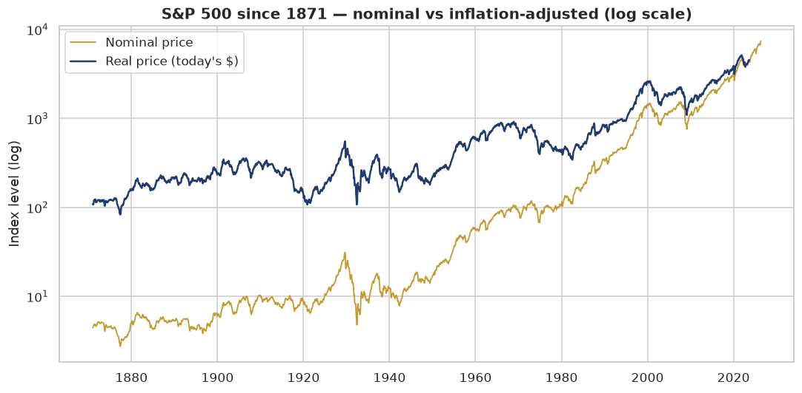
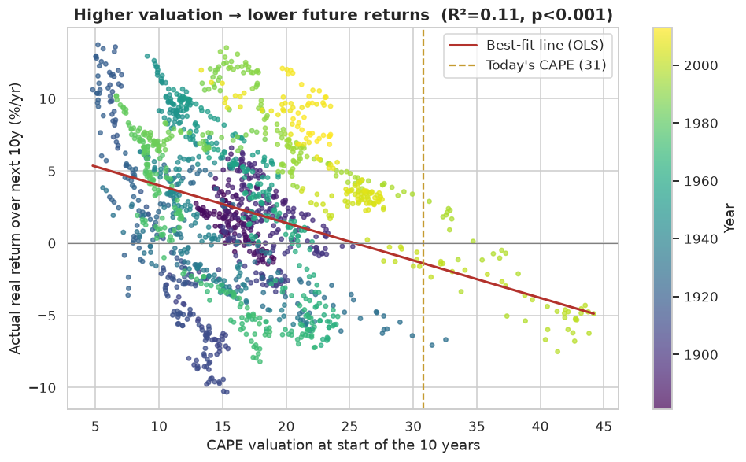
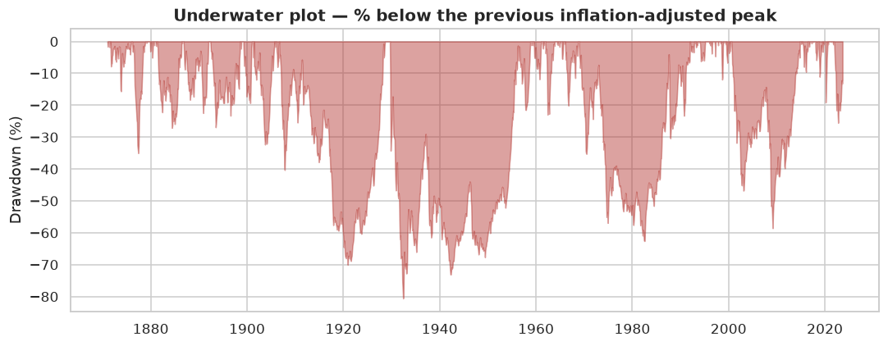

# Project 3 — US Stock Market: Trends, Risk and Valuation
Real public market data · Python, statistics, and SQL

## Summary
This project uses more than 150 years of real market data to answer the questions a long-term
investor actually asks: where does the market stand, how much risk has it historically carried,
is it expensive today, and does that tell us anything useful about the years ahead.

A few things stood out:

- Once you remove inflation, the index's price has grown about 2.4% a year. Most of the large
  headline numbers come from inflation and reinvested dividends rather than real price growth, so
  return expectations should be set with that in mind.
- Large losses are a normal part of the record, not an exception. In real terms the market has
  fallen as much as 81% from a previous peak (the early 1930s), and the VIX "fear gauge" jumps
  during every crisis.
- Starting valuation has tracked future returns. Months with a higher CAPE were generally
  followed by lower real returns over the next ten years (p < 0.001). Today's CAPE is in the top
  5% of readings since 1881, which historically has meant below-average returns from here.
- Gold has had close to zero correlation with stocks, so it has helped cushion the deep
  drawdowns that show up repeatedly in the data.

Taken together, the data points to modest real returns over the next decade, a case for
diversification, and a reminder that the hardest part of investing is behavioural: staying
invested through the long stretches when the market is underwater.

> Data: real and public. Sources are Robert Shiller's S&P 500 dataset, the CBOE VIX, and LBMA
> gold, pulled from GitHub's `datasets/` collection — the same underlying series exposed by
> yfinance and FRED. The details are in `NOTES.md`.

## Problem
A long-term investor needs an evidence-based read on four things: the real (inflation-adjusted)
trend, the level of risk, whether valuations are stretched, and whether the assets in a portfolio
actually diversify each other. The analysis is organised around those four questions.

## Approach
I pulled the data with a reproducible script (`data/download_data.py`): monthly S&P 500 figures
back to 1871, daily VIX from 1990, monthly gold, and the current index constituents. The most
important cleaning decision was that recent months store `0.0` as a placeholder for fundamentals
that have not been reported yet; treating those as real zeros would have distorted every average,
so I converted them to missing values.

From there the work moved from description to testing. The exploratory charts cover the long-run
real trend on a log scale, the history of valuations, the distribution of monthly returns, and
the VIX. The deeper analysis adds a drawdown ("underwater") view, an OLS regression of CAPE
against the real return over the following ten years, and a cross-asset correlation matrix. I
also loaded the cleaned monthly table into SQLite and used a `LAG` window function to rank the
best and worst calendar years.

## Key findings

The real trend is steady but modest; inflation accounts for most of the apparent growth.



Valuation has historically predicted the next decade's returns. Each point is one month; the
downward slope means a higher price paid was followed by a lower future return (R² = 0.11,
p ≈ 1e-40). Today's CAPE, marked in gold, is near the top of its range.



Deep drawdowns recur throughout the record, with the worst real loss reaching 81%.



| Metric (latest real data) | Value |
|---|---|
| Long-run real price growth | ~2.4% per year |
| Current CAPE valuation | 30.8, higher than 95% of all months since 1881 |
| Model-implied next-10y real return | Below the 2.3% historical average |
| Worst real drawdown in history | −81% (trough June 1932) |
| Stocks vs gold correlation | ≈ 0 |
| Worst / best calendar years | 1931 (−46%) / 1933 (+46%) |

## Recommendation
For a long-term investor, the data supports three practical steps: set return expectations
around the below-average real returns implied by today's high valuation rather than the recent
past; pair equities with low-correlation assets such as gold or bonds to soften the drawdowns
the record shows are inevitable; and automate contributions and rebalancing, because the main
risk the data exposes is selling during the long underwater periods.

## Limitations and next steps
The regression is a simple linear fit, so its point estimate at today's record valuation should
be read as "below average" rather than a precise number. Useful extensions would be a
total-return series that includes reinvested dividends for a truer long-run figure, an
out-of-sample backtest with confidence bands around the valuation signal, and a check of whether
the same relationship holds across sectors and international markets.

---

## Repository contents
| Path | What it is |
|---|---|
| `analysis.ipynb` | The full analysis, run top to bottom with outputs included |
| `data/download_data.py` | Reproducible data downloader, with a synthetic fallback |
| `data/raw_*.csv` | The downloaded datasets |
| `charts/` | Generated figures |
| `dashboard/` | BI-ready CSVs (`fact_market_monthly`, `dim_year`, `dim_sector`) |
| `DASHBOARD_GUIDE.md` | Tableau and Power BI build guide |
| `LEARN.md` | Plain-language walkthrough and glossary |
| `NOTES.md` | Issues encountered and how I resolved them |

## How to run it
```bash
cd project-3-finance
python data/download_data.py                # refresh the data (optional)
python -m jupyter notebook analysis.ipynb   # open, then Restart & Run All
```
`LEARN.md` has a step-by-step version for readers who are new to the tools.
